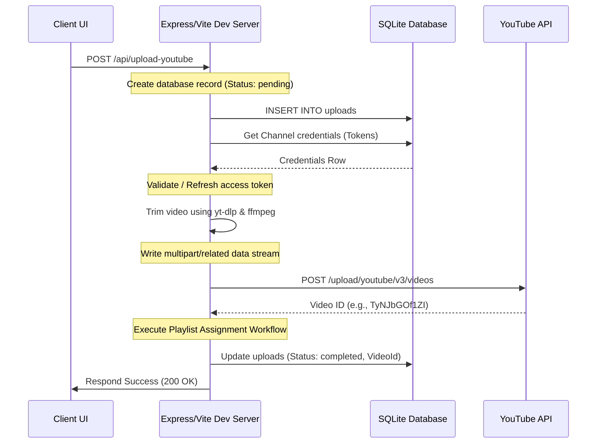

# ClapClip Project Status & Architecture Documentation

This document describes the current system state, features, database layout, backend APIs, workflows, and future enhancements of the ClapClip (Premium YouTube Video Clipper) application.

---

## Working Features
* **Local Video Clipping & Trimming**: Trims high-quality clips from any public YouTube URL using local server-side processes (`yt-dlp` and static `ffmpeg`).
* **Secure OAuth2 Channel Connection**: Authorizes YouTube channels with Google OAuth consent. Support server-side credentials via `.env` files (which hides inputs from the client) and includes a client-side inputs fallback mode.
* **Multi-Channel Support**: Supports connecting and disconnecting multiple channels with tokens securely stored in a local SQLite database.
* **Playlist Syncing & Caching**: Fetches playlists from the authorized channel's YouTube account and caches them in the database for quick retrieval.
* **YouTube Upload Integration**: Processes clips locally and uploads them directly to the connected channel as public videos.
* **Playlists Assignment**: Automatically adds uploaded clips to the selected playlist immediately after a successful upload.
* **Upload Logs History**: Keeps a complete local log of clips trimmed, statuses (`pending`, `uploading`, `completed`, `failed`), and error codes/messages.

---

## Database Schema

ClapClip uses a local SQLite database (`clipper.db`) configured with foreign keys enabled. The tables are structured as follows:

### 1. `channels`
Stores Google OAuth2 credential client secrets, tokens, expiration timestamps, and metadata for authorized channels.
```sql
CREATE TABLE IF NOT EXISTS channels (
  channel_id TEXT PRIMARY KEY,
  channel_name TEXT,
  channel_avatar TEXT,
  client_id TEXT,
  client_secret TEXT,
  access_token TEXT,
  refresh_token TEXT,
  expires_at INTEGER,
  status TEXT DEFAULT 'connected',
  created_at INTEGER
);
```

### 2. `playlists`
Caches synced playlists of the connected YouTube channels.
```sql
CREATE TABLE IF NOT EXISTS playlists (
  playlist_id TEXT PRIMARY KEY,
  channel_id TEXT,
  title TEXT,
  synced_at INTEGER,
  FOREIGN KEY(channel_id) REFERENCES channels(channel_id) ON DELETE CASCADE
);
```

### 3. `uploads`
Tracks history and completion metrics of clip downloads and uploads.
```sql
CREATE TABLE IF NOT EXISTS uploads (
  id INTEGER PRIMARY KEY AUTOINCREMENT,
  video_id TEXT,
  title TEXT,
  start_time REAL,
  end_time REAL,
  playlist_id TEXT,
  channel_id TEXT,
  status TEXT DEFAULT 'pending',
  error_message TEXT,
  youtube_video_id TEXT,
  created_at INTEGER,
  FOREIGN KEY(channel_id) REFERENCES channels(channel_id) ON DELETE CASCADE
);
```

---

## API Endpoints

### 1. Configurations & OAuth
* `GET /api/config`: Verifies if server-side `GOOGLE_CLIENT_ID` and `GOOGLE_CLIENT_SECRET` are set in `.env`.
* `GET /api/auth`: Redirects user to Google OAuth 2.0 login flow with required scopes.
* `GET /api/callback`: Handles the redirect from Google, exchanges authorization codes, fetches channel metadata, caches credentials in SQLite, and returns a popup-closing UI script.
* `GET /api/channels`: Returns metadata of connected channels (access & refresh tokens are masked).
* `POST /api/channels/delete`: Disconnects and deletes credentials of a channel.

### 2. Playlists
* `POST /api/playlists`: Retrieves cached playlists for a specific channel.
* `POST /api/playlists/sync`: Forces a synchronization cycle to fetch and overwrite cached playlists from the YouTube API.

### 3. Clipper & Uploads
* `GET /api/uploads`: Retrieves list of past and active upload transaction records.
* `GET /api/download`: Streams trimmed clip download directly to the client as a `.mp4` attachment.
* `POST /api/upload-youtube`: Main workflow endpoint to download, trim, upload to YouTube, and assign the video to the selected playlist.

---

## OAuth Configuration

### Required Scopes
The scopes configured in the application are:
* `https://www.googleapis.com/auth/youtube.upload` (to upload videos)
* `https://www.googleapis.com/auth/youtube.readonly` (to retrieve playlists)
* `https://www.googleapis.com/auth/youtube` (full management scope required to add videos to playlists via `youtube/v3/playlistItems`)

### Redirection
* **Redirect URI**: `http://localhost:5173/api/callback`
* **State Parameter**: Stateless base64 encoded client credentials package sent dynamically to retrieve configured clientId and clientSecret in callback responses.

---

## Upload Workflow



---

## Playlist Workflow

1. **Check Condition**: When `POST /api/upload-youtube` completes successfully, it checks if a non-empty `playlistId` was sent in the client request body.
2. **Assign Request**: If present, it executes a `POST` request to `https://www.googleapis.com/youtube/v3/playlistItems?part=snippet` containing the authorization bearer token.
3. **Payload Structure**:
   ```json
   {
     "snippet": {
       "playlistId": "<selected-playlist-id>",
       "resourceId": {
         "kind": "youtube#video",
         "videoId": "<uploaded-video-id>"
       }
     }
   }
   ```
4. **Execution**: If the call succeeds, it logs validation and completes. If it fails, it logs errors to standard error but prevents the overall upload response to the client from throwing a server error.

---

## Remaining Bugs

* **Active Channel Scope Cache**: Although the scopes list in `vite.config.js` has been updated to request `https://www.googleapis.com/auth/youtube`, any channels authorized prior to this change hold access tokens missing this permission scope, leading to `403 PERMISSION_DENIED (ACCESS_TOKEN_SCOPE_INSUFFICIENT)` errors during playlist insertion. Users must disconnect and reconnect their channel to grant the new scope.
* **Playlist Error Silencing**: When playlist insertion fails, the error message is outputted to console logs but is not updated inside the database log entry `error_message` because the main video upload was completed successfully.

---

## Future Improvements

1. **Pre-Check Scope Support**: Verify if the active connection contains the full `youtube` scope before attempting playlist additions to guide the user in-app.
2. **Chunked Resumable Uploads**: Implement chunked streaming via `/upload/youtube/v3/videos?uploadType=resumable` to support massive or long video clips.
3. **Real-time Progress Transmissions**: Establish Server-Sent Events (SSE) or WebSockets to broadcast percentage of downloading, trimming, and upload tasks.
4. **Direct Playlist Management**: Enable users to create new playlists directly from the ClapClip settings layout.
