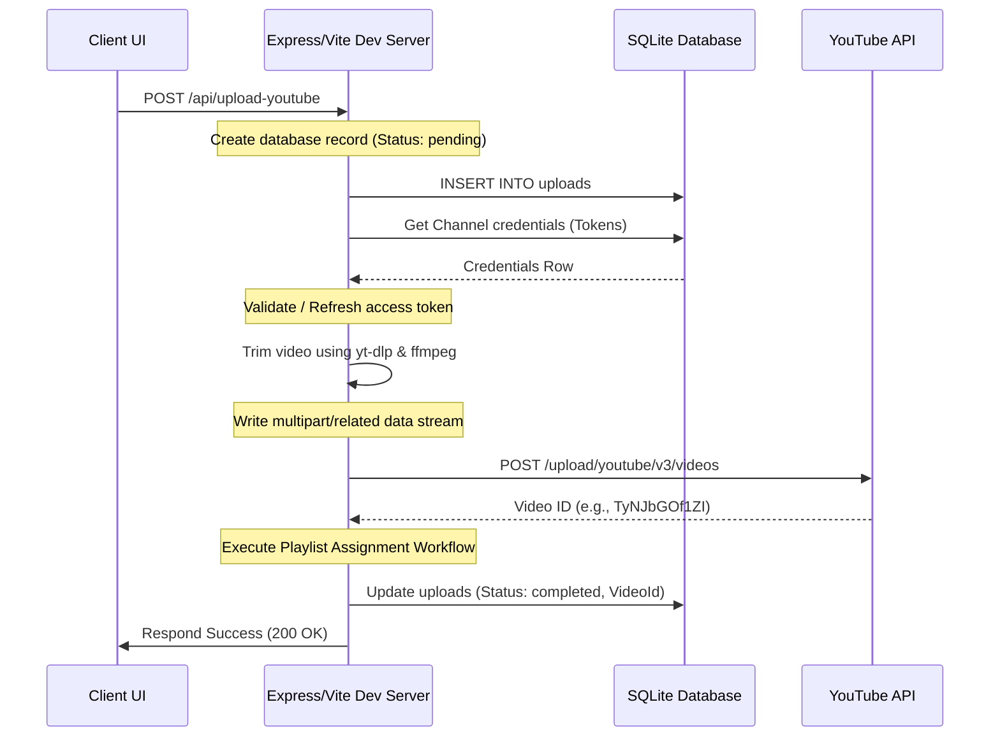

# 🎬 ClapClip

### Self-Hosted YouTube Video Clipper with Direct Playlist Upload

[](https://nodejs.org/)
[](https://developer.mozilla.org/en-US/docs/Web/JavaScript)
[](https://www.docker.com/)
[](https://www.sqlite.org/)
[](https://developers.google.com/youtube/v3)

---

ClapClip is a self-hosted web application that allows users to connect their YouTube channel, trim specific portions of YouTube videos using start and end timestamps, upload the generated clip directly to YouTube, and automatically add it to a selected playlist.

---

## 🚀 Key Features

* **Google OAuth 2.0 Authentication**: Secure authentication and channel management with access and refresh token rotation.
* **Multiple YouTube Channel Support**: Connect and manage multiple YouTube channels from a single dashboard.
* **Playlist Synchronization**: Dynamically fetch and sync playlists from your YouTube channel for automatic targeting.
* **Timestamp-based Video Clipping**: Trim specific portions of any YouTube video by providing start and end timestamps.
* **FFmpeg Video Processing**: Server-side video trimming, stream merging, and container wrapping for high-quality `.mp4` outputs.
* **yt-dlp Integration**: High-performance extraction of stream segments without download overhead for full videos.
* **Direct Upload to YouTube**: Publish trimmed clips directly to YouTube with automated title, description, and privacy settings.
* **Automatic Playlist Assignment**: Automatically add clips to selected playlists immediately after a successful upload.
* **Upload History Dashboard**: Monitor status logs (`pending`, `uploading`, `completed`, `failed`) and upload tracking metrics.
* **SQLite Database**: Lightweight local data persistence for channels, playlists, and uploads history tracking.
* **Docker Support**: Containerized environment ensuring all system dependencies (FFmpeg, python3, yt-dlp) are bundled seamlessly.
* **Railway Deployment Ready**: Production-ready configurations for deployment in cloud environments like Railway.

---

## 🛠️ Tech Stack

### Frontend
* **HTML5**: Structured document layouts.
* **CSS3**: Premium custom styling featuring a glassmorphic dark-theme design, Outfit & Plus Jakarta Sans typography, and responsive grid structures.
* **Vanilla JavaScript**: ES Modules managing state bindings, API requests, and event configurations.

### Backend
* **Node.js**: Server environment executing backend routing.
* **Vite Middleware**: Dev server framework integration (`configureServer` lifecycle) for unified routing.
* **SQLite**: Lightweight database persistence via `sqlite3`.

### Libraries & Utilities
* **yt-dlp**: Segment-based stream extraction wrapper.
* **FFmpeg**: Merging video/audio streams and final container wrapping (via `ffmpeg-static`).
* **sqlite3**: DB driver interfacing and query handling.
* **Google APIs**: YouTube Data API v3 and OAuth 2.0 integration libraries.

### Deployment
* **Docker / docker-compose**: Multi-stage runner environment.
* **Railway**: Web app and SQLite deployment optimization.

---

## 🏛️ System Architecture

```text
                                  +-----------------------+
                                  |   ClapClip Frontend   |
                                  | (HTML5 / Vanilla CSS) |
                                  +-----------+-----------+
                                              |
                                     HTTP API | (/api/*)
                                              v
+---------------------------------------------+---------------------------------------------+
|                                  Vite Dev Server (Node.js)                                 |
|                                                                                           |
|  +--------------------+    +--------------------+    +--------------------+               |
|  |   OAuth Handler    |    |  Database Methods  |    |  Video Processor   |               |
|  |  (Token exchange / |    |   (src/db.js /     |    | (yt-dlp & ffmpeg)  |               |
|  |    refreshes)      |    |    clipper.db)     |    |                    |               |
|  +---------+----------+    +---------+----------+    +---------+----------+               |
+------------|-------------------------|-------------------------|--------------------------+
             |                         |                         |
             | HTTP (OAuth / API)      | SQL Queries             | Process Spawn / Streams
             v                         v                         v
   +---------+---------+     +---------+---------+     +---------+---------+
   |   Google APIs     |     |   clipper.db      |     |  Local Filesystem |
   |  (YouTube v3)     |     | (SQLite Database) |     |     (./temp/)     |
   +-------------------+     +-------------------+     +-------------------+
```

---

## 📸 Screenshots

> [!NOTE]
> Below are UI placeholders representing the modern glassmorphic interface layout.

* **Dashboard Overview**: `[Screenshot Placeholder: Dashboard Screenshot]`
* **YouTube Upload Flow**: `[Screenshot Placeholder: Clip Upload Form]`
* **YouTube Channel Connections**: `[Screenshot Placeholder: Connected Channels]`
* **Upload Audit Logs**: `[Screenshot Placeholder: Upload History]`

---

## 📦 Installation

Ensure you have [Node.js](https://nodejs.org/) (v20+) installed on your machine.

### 1. Set Up Environment Variables
Create a `.env` file in the project root and add your credentials:
```env
GOOGLE_CLIENT_ID=your_google_oauth_client_id
GOOGLE_CLIENT_SECRET=your_google_oauth_client_secret
API_SECRET=your_api_secret
ENCRYPTION_KEY=your_encryption_key
```

### 2. Install Dependencies
```bash
npm install
```

### 3. Run Development Server
```bash
npm run dev
```
Open [http://localhost:5173/](http://localhost:5173/) in your web browser.

---

## 🐳 Docker Deployment

ClapClip is pre-configured for Docker using a multi-stage Dockerfile that installs all necessary dependencies (`ffmpeg`, `python3`, `yt-dlp`).

### Build & Run via Docker Compose
To compile the production assets and spin up the container environment, run:
```bash
docker-compose up -d --build
```
This maps the application to `http://localhost:5173/` and mounts persistent named volumes for the database, logs, and backups.

### Volumes Configuration
The following volumes are generated dynamically for local data persistence:
* `clipper_db`: Mounts to `/app/database` tracking SQLite credentials and logs.
* `backups_volume`: Mounts to `/app/backups` for safety backups.
* `logs_volume`: Mounts to `/app/logs` tracking transaction outputs.

---

## ⚙️ Environment Variables

| Variable | Description | Required / Optional |
|---|---|---|
| `GOOGLE_CLIENT_ID` | Your Google OAuth 2.0 Web Application Client ID. | Required for OAuth |
| `GOOGLE_CLIENT_SECRET` | Your Google OAuth 2.0 Web Application Client Secret. | Required for OAuth |
| `API_SECRET` | Secret key used to sign/verify custom API request authorizations. | Optional |
| `ENCRYPTION_KEY` | Symmetric key used to encrypt cached credentials/tokens in SQLite database. | Required for DB encryption |

---

## 📂 Project Structure

```text
.
├── bin/                       # Automatically downloaded platform-specific yt-dlp binaries
├── dist/                      # Production bundles compiled from source assets
├── node_modules/              # Node dependencies packages
├── scratch/                   # Developer script testing folder
├── src/                       # Main source code directory
│   ├── db.js                  # Database connection, helper queries, and schema initializer
│   ├── main.js                # Frontend controllers, event handlers, and API bindings
│   └── style.css              # Main dark-mode glassmorphic stylesheets
├── temp/                      # Working folder for downloaded video clips (auto-cleaned)
├── tests/                     # Integration and unit test cases
├── .dockerignore              # Specifies files to ignore during Docker builds
├── .env                       # Environment configuration secrets (GOOGLE_CLIENT_ID/SECRET)
├── .gitignore                 # Files excluded from git version control
├── clipper.db                 # Local SQLite database instance (auto-created on start)
├── docker-compose.yml         # Docker orchestration definition
├── Dockerfile                 # Container image build configuration
├── index.html                 # Main interface template file
├── package.json               # Manifest dependencies configuration
├── PROJECT_STATUS.md          # Current system status audit document
├── README.md                  # This file
└── vite.config.js             # Vite development server, endpoints, and video processing routines
```

---

## 🔄 How It Works

### 1. Channel OAuth Connection Flow
1. **Initiation**: The client clicks "Connect Channel". The frontend queries `GET /api/config` to check if a `.env` file contains credentials.
2. **Consent Redirection**: The server routes `GET /api/auth`, bundles credentials (or environment fallbacks) and scopes (`youtube.upload`, `youtube.readonly`, and `youtube`), and redirects to Google Accounts.
3. **Callback & Exchange**: The user signs in and is redirected back to `GET /api/callback`. The server exchanges the authorization code for access & refresh tokens, queries Google for YouTube channel details, and stores credentials in the local `channels` table in `clipper.db`.
4. **Integration**: A script closes the popup, sends channel info to the parent window, and displays the channel as connected.

### 2. Clipping & Download Flow
1. The user inputs a YouTube video link, start/end timestamps, and clicks "Download Clip".
2. The browser requests `GET /api/download` with video params.
3. The server ensures the OS-specific `yt-dlp` binary is downloaded/present inside the `./bin/` directory.
4. The server runs `yt-dlp` in a child process with arguments:
   `--download-sections "*start_seconds-end_seconds"`
5. `yt-dlp` downloads the section, calls `ffmpeg` to merge streams into a clean `.mp4` file in `./temp/`, and the server pipes the stream download back to the client as an attachment.
6. The temp file is automatically deleted from the server once stream delivery completes.

### 3. YouTube Upload & Playlist Assignment Flow
1. The user selects a connected channel, start/end timestamps, fills metadata fields (title, description, playlist), and clicks "Upload to YouTube".
2. The browser initiates a request to `POST /api/upload-youtube`.
3. The server logs the transaction in the `uploads` table (status: `pending`), checks if the channel token has expired, and automatically requests a fresh token using `refresh_token` if necessary.
4. The video is trimmed locally to a `.mp4` file in the `./temp/` directory.
5. The server creates a multipart payload consisting of metadata (JSON) and media content (binary file data) separated by boundaries, and posts it to:
   `https://www.googleapis.com/upload/youtube/v3/videos?uploadType=multipart&part=snippet,status`
6. Once uploaded, Google returns the new Video ID.
7. **Playlist insertion**: If a playlist ID is selected, the server performs a `POST` request to `https://www.googleapis.com/youtube/v3/playlistItems?part=snippet` using the `youtube` management scope.
8. The database record is marked as `completed` with the returned YouTube Video ID, and the temporary file is deleted.

---

## 🔗 Upload Workflow

```text
Connect Channel ➔ Sync Playlists ➔ Paste YouTube URL ➔ Select Start & End Time ➔ Generate Trimmed Clip ➔ Upload to YouTube ➔ Automatically Add to Playlist ➔ View Upload History
```

### Sequence Flow Detail



---

## 🗺️ Roadmap

### Completed Features
- [x] **OAuth Authentication**: Google OAuth 2.0 flow integrated.
- [x] **Playlist Sync**: Automatic channel playlists fetching and local database caching.
- [x] **Upload History**: Persistence tracking of operations inside `clipper.db`.
- [x] **Direct Upload**: Streamlined clip uploads to authorized channels.
- [x] **Video Trimming**: High-performance trimming with `yt-dlp` and `ffmpeg`.

### Future Milestones
- [ ] **Retry Failed Uploads**: Automatic queue re-processing.
- [ ] **Scheduled Uploads**: Cron-style triggers for automated clipping releases.
- [ ] **Bulk Queue**: Batch paste multiple URLs and timestamps to process simultaneously.
- [ ] **Search Upload History**: Advanced filtering and search functionality on historical logs.
- [ ] **Advanced Analytics**: Metrics graphs on clip performance and uploads tracking.

---

## 🤝 Contributing

Contributions make the open-source community a fantastic place to learn, inspire, and create.
1. Fork the Project.
2. Create your Feature Branch (`git checkout -b feature/AmazingFeature`).
3. Commit your Changes (`git commit -m 'Add some AmazingFeature'`).
4. Push to the Branch (`git push origin feature/AmazingFeature`).
5. Open a Pull Request.

---

## 📄 License

Distributed under the **MIT License**. See `LICENSE` for more information.
